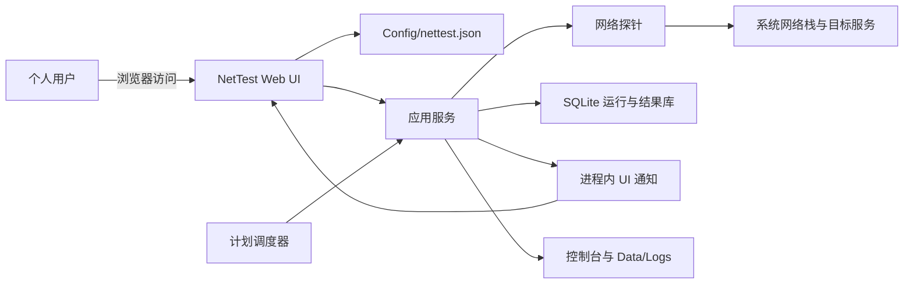
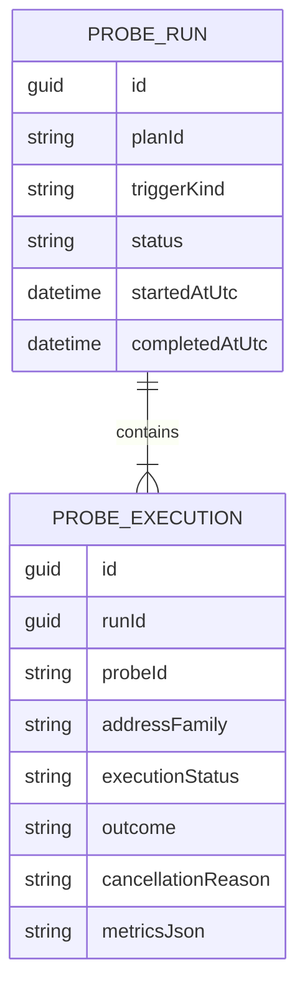
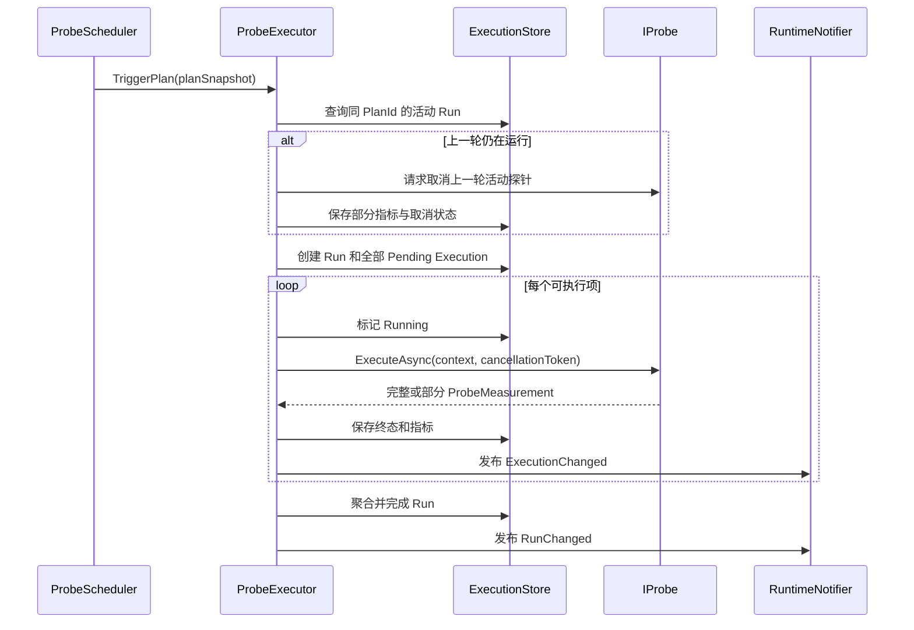
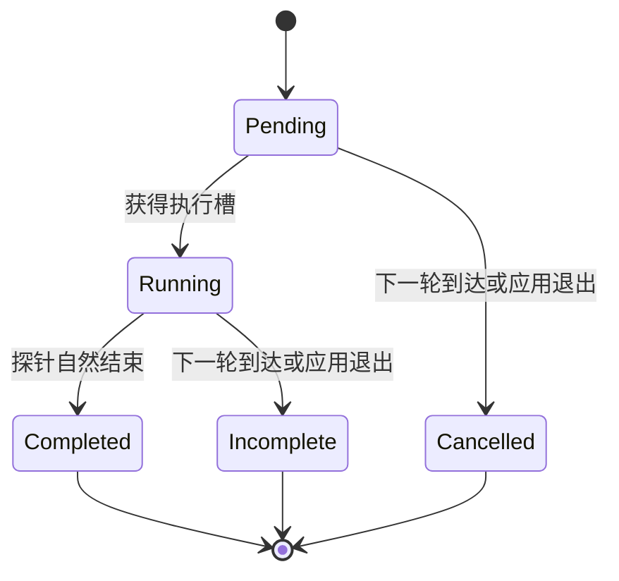

# NetTest 系统设计文档

## 1. 文档目的

本文档描述 NetTest 的系统边界、架构分层、组件职责、核心数据流、运行状态和故障恢复策略。具体配置字段、数据库列、C# 接口及算法约束见 [TechnicalSpecification.md](./TechnicalSpecification.md)，实施范围与默认值以 [Plan.md](./Plan.md) 为基线。

## 2. 产品定位

NetTest 是运行在 Windows x64 上的单用户网络数据采集与可视化工具。系统从运行主机的网络视角定期执行 Ping、Tracert、DNS 和 HTTPS 测量，将观测结果保存到本地 SQLite，并通过 Blazor Web UI 展示当前状态、历史趋势和运行详情。

### 2.1 设计目标

- 以便携程序形式手动启动，不依赖安装器或外部数据库。
- 使用 JSON 保存用户配置，使配置可审阅、可备份，同时通过 Web UI 降低编辑出错概率。
- 精确区分网络测量结果与调度执行状态，保留取消前已经取得的部分数据。
- 支持同一探针绑定多个计划，并保持不同计划的数据来源可追踪。
- 对 IPv4 和 IPv6 分别采样，保留实际解析和连接地址。
- 在单机规模下保持实现简单，同时具备可恢复、可测试和可迁移的数据边界。

### 2.2 非目标

- 不提供多用户、角色和细粒度授权。
- 不提供邮件、短信、Webhook 等外部告警。
- 不对外提供完整 REST API。
- 不执行 TCP 抓包、IP 归属查询或分布式多节点采集。
- 不自行选择或绑定网卡，网络路由由操作系统决定。
- 不保存 HTTPS 响应正文，也不进行正文内容断言。

## 3. 系统上下文



系统只包含一个 ASP.NET Core 进程。Web UI、调度器、探针执行器和数据访问组件共享同一个依赖注入容器，但通过接口和生命周期隔离并发状态。

## 4. 总体架构

### 4.1 逻辑分层

| 层 | 职责 | 依赖方向 |
| --- | --- | --- |
| NetTest.Core | 探针契约、探针实现、执行状态、调度编排、持久化端口 | 仅依赖 .NET 和网络协议库 |
| NetTest.Data | EF Core 实体、迁移、SQLite 持久化和历史查询 | 依赖 Core |
| NetTest.Web | Blazor UI、配置管理、认证、宿主启动、后台服务注册 | 依赖 Core 和 Data |
| Tests | 单元、集成和端到端测试 | 按测试目标引用上述项目 |

持久化接口定义在 Core，Data 提供实现，避免 Core 直接引用 EF Core。Web 负责组合组件，不承担探针协议逻辑。

### 4.2 主要组件

| 组件 | 职责 |
| --- | --- |
| ConfigManager | 加载、验证、原子保存和重新加载 JSON 配置，发布配置版本变化 |
| ProbeScheduler | 计算计划下一次执行时间，不补跑停机期间的计划 |
| ProbeExecutor | 建立运行批次、排队探针、处理取消、聚合状态和保存部分结果 |
| ProbeRegistry | 按探针类型解析配置并选择对应 `IProbe` 实现 |
| ExecutionStore | 保存 Run/Execution 状态，执行恢复、清理和趋势查询 |
| RuntimeNotifier | 在进程内发布运行和配置变化，驱动 Blazor 组件刷新 |
| CapacityNoticeService | 计算最近运行的取消比例，管理 UI 提示及日志去重 |
| RetentionWorker | 每日清理过期结果和日志，不参与网络测量调度 |

### 4.3 单进程选择

单进程降低了个人部署和配置成本，并允许调度器、手动操作和 UI 共享执行服务。SQLite 仍然只有一个并发写事务，因此系统使用独立 DbContext、短事务、WAL 和 busy timeout 管理并发；单进程本身不被视为避免锁冲突的保证。

## 5. 配置架构

### 5.1 配置所有权

`Config/nettest.json` 是探针、计划和宿主设置的唯一配置源。配置不复制到数据库。Web UI 是推荐编辑入口，但其本质仍是对 JSON 的验证和原子修改。

数据库结果通过稳定的配置 ID 和运行时配置快照解释，因此配置被重命名、修改或删除后，历史数据仍可独立展示。

### 5.2 配置生效范围

- 探针、计划、保留期和调度容量设置保存后立即重新加载。
- 已经开始的运行继续使用启动时快照，新配置从下一次调度生效。
- 监听地址、密码和日志路径属于宿主设置，保存后提示重启。
- 外部直接修改 JSON 不做文件监听，在下次启动时加载。
- 配置验证失败时保留当前有效配置，不进行部分应用。

### 5.3 配置写入可靠性

ConfigManager 先在内存中构建并验证完整配置，再写入同目录临时文件，刷新到磁盘后原子替换正式文件，并保留最近一份 `.bak`。任何步骤失败都不会破坏当前有效配置。

## 6. 运行与调度设计

### 6.1 核心关系

一个探针定义可以属于一个或多个计划，一个计划可以包含多个探针定义。关系保存在 JSON 中，不在数据库建立配置外键。

每次计划或手动触发创建一个 `ProbeRun`。Run 启动时为本次涉及的每个探针和地址族创建 `ProbeExecution`，因此尚未开始、运行中和已完成的操作均可追踪。



### 6.2 计划触发流程



### 6.3 重叠计划策略

同一计划的下一次执行时间到达时，系统取消上一轮并等待其保存部分数据，然后启动新一轮。已经开始的 Execution 标记为 `Incomplete`，尚未开始的标记为 `Cancelled`，原因均为 `SupersededByNextRun`。

不同计划相互独立。即使它们引用同一个探针定义，也分别执行并记录各自 PlanId。手动运行不会取消计划运行，计划运行也不会取消手动运行。

### 6.4 执行状态与测量结果

执行状态描述任务是否完整执行，结果类别描述网络测量得到什么结论，两者不得混用。



网络超时是探针自然结束后的有效结果，表示为 `Completed + NetworkTimeout`。只有调度或应用生命周期中断导致的执行才使用 `Incomplete` 或 `Cancelled`。

### 6.5 并发与背压

- 执行请求进入有界队列，避免大量手动或计划任务无限占用内存。
- 不同逻辑分组允许并发，同组探针串行，减少同一目标的测量互扰。
- 全局并发上限默认为 10，并可通过配置调整。
- 每个探针都必须协作响应 CancellationToken，并在取消时返回已经取得的部分指标。
- 下一轮计划仅在上一轮完成取消收尾后启动，避免同一计划短暂重叠。

### 6.6 容量提示

系统按计划查看最近 10 次 Scheduled Run。若其中至少 60% 因 `SupersededByNextRun` 未完整完成，则在仪表盘和计划页显示容量提示，并在阈值首次跨越时记录一条 Warning。比例恢复后自动清除提示并记录一条 Information。

网络失败、手动运行、应用退出和配置修改不计入该比例。该机制只提示计划周期与执行耗时不匹配，不属于外部告警系统。

## 7. 探针设计

### 7.1 地址解析

IP 字面量只生成对应地址族的 Execution。域名分别解析 A 和 AAAA，每个地址族选择 DNS 返回顺序中的第一个地址。有记录但连接失败时保存失败结果；没有对应记录时不创建该地址族的网络执行结果。

HTTPS 直连模式在强制连接选定 IP 时仍使用原始域名完成 SNI 和 Host 验证。System/Custom 代理模式由代理决定目标解析与路由，不拆分目标 IPv4/IPv6 Execution，目标地址族和实际地址留空。直连结果记录地址族和实际地址，避免双栈及 CDN 地址混入同一数据序列。

### 7.2 部分结果

- Ping 保存取消前已经完成的响应及其统计。
- Tracert 保存取消前已经完成的 hops。
- DNS 只有收到完整 DNS 响应后才产生协议结果。
- HTTPS 保存已经完成的 DNS、TCP、TLS、首字节阶段，以及取消时已读取字节数和耗时。

部分结果保存在历史详情，并在趋势图使用特殊标记，但默认不参与完整样本的均值、分位数等汇总。

### 7.3 HTTPS 边界

HTTPS 使用 GET 读取完整响应流并丢弃正文，只保存阶段耗时、状态、最终 URI、重定向、证书信息和字节数。每次测量建立新连接，以保证 DNS/TCP/TLS 数据属于本次请求。响应受总超时、重定向数和最大读取量约束。

## 8. 数据与查询设计

### 8.1 数据职责

SQLite 只保存运行状态、测量结果和配置快照。配置本身以及探针与计划关系不入库。ProbeExecution 是可更新的状态记录，不再采用“结果只增不改”的模型。

### 8.2 历史与保留

- 原始结果默认保留 90 天，每日批量清理。
- 历史列表使用服务端分页，不允许无时间范围读取全部数据。
- 图表每个序列最多返回 2,000 点，超过时由服务端按时间桶聚合。
- 手动结果默认从趋势查询排除，可由用户显式包含。
- 配置快照和 Metrics JSON 都带版本，确保旧数据可以按原语义解释。

### 8.3 恢复策略

正常关闭时，宿主取消调度和活动探针，保存部分结果后退出。异常结束无法保证内存中的最后一步测量已落库；下次启动将遗留的 Running 标记为 `Incomplete/ApplicationExit`，Pending 标记为 `Cancelled/ApplicationExit`。

## 9. Web UI 设计

### 9.1 信息架构

| 页面 | 主要内容 |
| --- | --- |
| 仪表盘 | 最近计划运行、探针概览、趋势图、容量提示 |
| 探针配置 | 按类型维护探针、地址、参数、计划关联、分组和标签 |
| 计划管理 | Cron、启用状态、关联探针、最近运行和下一次运行 |
| 手动检测 | 选择现有探针或输入临时参数，展示本次实时结果 |
| 历史记录 | 时间、计划、探针、地址族、状态和来源筛选 |
| 运行详情 | Run 汇总、每个 Execution 的完整或部分指标及配置快照 |
| 系统设置 | 监听地址、密码、保留期、并发、日志和重启提示 |

### 9.2 数据展示原则

- 默认趋势只显示 Scheduled 数据，用户可开启“包含手动检测”。
- 同一探针的计划数据默认合并，支持按 Plan 筛选。
- IPv4 和 IPv6 始终是不同序列。
- 部分结果使用不同标记和文字状态，不只依赖颜色表达。
- 无数据直接显示空状态，不推断程序停机、休眠或调度跳过原因。
- RuntimeNotifier 只通知数据发生变化，组件随后查询数据库；通知本身不作为可靠数据源。

### 9.3 交互通信

Blazor Interactive Server 组件直接调用应用服务。后台运行变化通过进程内 RuntimeNotifier 通知组件刷新，不额外创建自定义 SignalR Hub。导出和数据库备份通过少量受认证保护的 HTTP endpoint 提供。

## 10. 安全边界

- 默认只监听 loopback，未配置密码时允许直接访问。
- 配置密码后所有监听地址都要求单用户登录。
- 非本地监听且没有密码时允许启动，但写入去重 Warning。
- HTTP 密码只提供简单访问控制，不承诺防止局域网窃听；v1 不直接配置 Kestrel 证书，更高要求由 HTTPS 反向代理终止 TLS。
- 密码、代理凭据、Authorization Header 和敏感查询参数不得写入日志、结果或导出。
- Web UI 只能修改固定配置文件，不能接受任意文件路径。

## 11. 日志与可观测性

系统同时输出控制台日志和 `Data/Logs/` 滚动文件。日志包含 RunId、PlanId、ProbeId、触发来源、执行状态和取消链路。

网络超时、连接拒绝、TLS 错误等属于测量数据，不按系统 Warning 记录。Warning/Error 用于配置错误、数据库写入失败、取消无法收尾、非本地无密码监听、迁移失败和未处理异常。容量提示只在阈值跨越和恢复时记录，避免重复刷屏。

## 12. 部署与运行

发布产物为 Windows x64 便携目录，用户手动启动可执行文件后通过浏览器访问。程序目录包含：

```text
NetTest/
|-- NetTest.Web.exe
|-- Config/
|   |-- nettest.json
|   `-- nettest.json.bak
`-- Data/
    |-- nettest.db
    |-- Logs/
    `-- Backups/
```

数据路径基于 `AppContext.BaseDirectory`。升级时替换程序文件但保留 `Config/` 和 `Data/`。启动顺序为：获取单实例锁、加载配置、初始化日志、迁移数据库、恢复遗留运行、启动 Web 宿主和调度器。

## 13. 关键设计取舍

| 决策 | 选择 | 代价 |
| --- | --- | --- |
| 配置存储 | JSON 唯一数据源 | 需要可靠原子写入和历史快照 |
| 结果存储 | 本地 SQLite | 写入并发有限，不适合多实例 |
| UI 模型 | Blazor Interactive Server | 浏览器依赖持续连接，进程退出后 UI 不可用 |
| 实时更新 | 进程内通知后重新查询 | 不提供跨进程推送，但数据一致性更简单 |
| 重叠计划 | 取消旧运行并保存部分数据 | 周期过短可能持续产生不完整结果 |
| 双栈采样 | 每个地址族选择一个地址 | 不覆盖同族所有 CDN 地址 |
| HTTPS 正文 | 读取后丢弃 | 能测完整传输时间，但不验证业务内容 |
| 安全 | 可选单密码 | 适合个人可信环境，不等同完整身份系统 |
